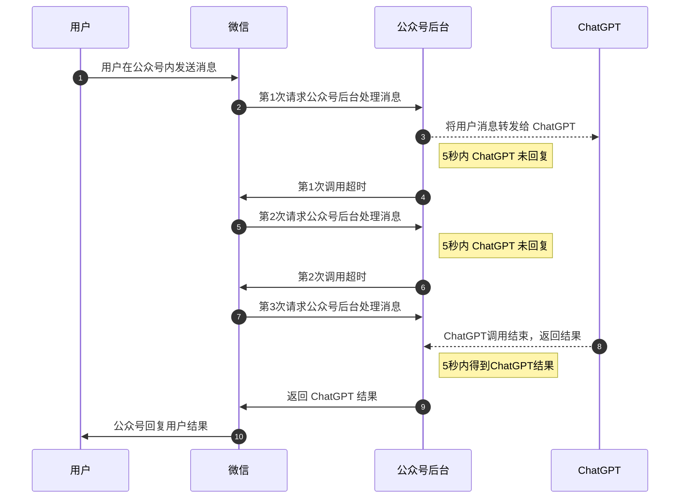
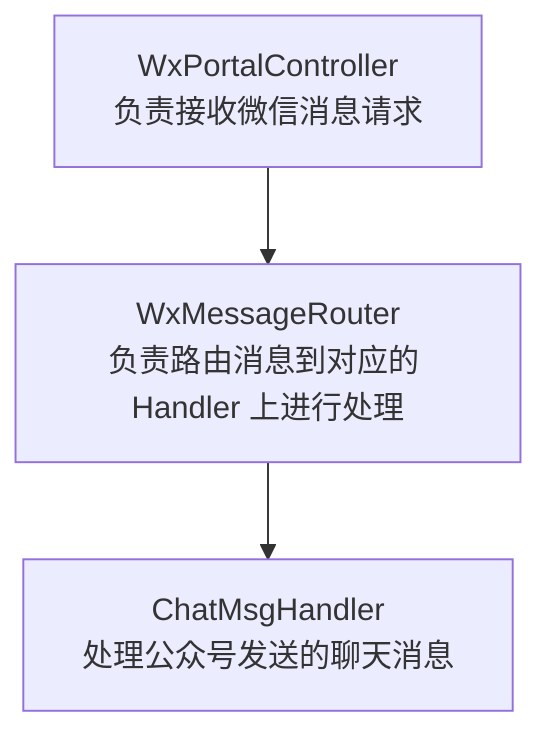

# 初试微信公众号开发与对接 ChatGPT 接口

上周公众号对接了 ChatGPT 接口，直接在公众号内即可与 ChatGPT 聊天。本文将整个对接的过程分享给大家

由于本人没有过公众号开发经验，所以先是直接百度了下「公众号对接 ChatGPT」，果然网上已经有简单案例了，代码如下：

```python
import werobot
import openai

robot = werobot.WeRoBot(token="your_wx_token")
robot.config["HOST"] = "0.0.0.0"
robot.config["PORT"] = 9005

openai.api_key = "your_api_key"

@robot.handler
def handle(messages):
    completion = openai.ChatCompletion.create(
        model="gpt-3.5-turbo",
        messages=[{"role": "user", "content": messages.content}]
    )
    return completion.choices[0].message.content

robot.run()
```

代码非常简洁，使用了 `werobot` 让我们可以快速开发公众号被动消息回复逻辑，利用 `openai` 库来调用调用 ChatGPT 接口。

**代码跑起来之后，我便迫不及待的给公众号发消息测试，简单测试后发现了如下的问题：**

1. 发送的所有消息都会转发给`ChatGPT`接口，会影响公众号后续的自动回复功能开发。
2. 示例代码中调用 ChatGPT 接口只传递了单条消息，没有保持整个会话的上下文，这样无法更好的体验 ChatGPT 功能
3. 公众号被动回复接口需要在 5 秒内做出响应，否则微信将进行 2 两次重试调用接口，而 ChatGPT API 稍微复杂点的问题基本都需要半分钟才能响应，由于微信的消息重试机制，一个问题我重复调用了 3 次 ChatGPT 且每一次都会超时，导致公众号无法正常响应用户消息。

## 解决思路

##### 第一个问题，我需要有个入口来开启聊天会话，只有开启了会话之后的消息才需要被 ChatGPT 处理。

对于这个问题，我首先想到的是增加一个公众号菜单，当用户点击公众号菜单「ChatGPT」时开启会话，开启会话后的消息让 ChatGPT 来处理。

很快这个思路就被否定了，原因是我的公众号没有权限，无法处理菜单点击事件，只能设置回复公众号内的文章消息。

**最终解决方案：** 让用户输入发送特定的消息来开启会话

> 发送`/chatgpt`指令消息开启会话，会话有效时常为 5 分钟，发送消息可延长有效期，会话失效后需要重新启动会话

##### 第二个问题，需要保持 ChatGPT 的上下文

通过查阅`ChatGPT`官方文档得知，想要保持上下文，需要每次请求的时候把之前用户发送的消息 和 ChatGPT 回复的消息都放到请求参数中，通过`role`来区分用户消息(user)和助理消息(assistant)，请求参数`JSON`示例：

```json
{
  "model": "gpt-3.5-turbo",
  "messages": [
    {"role": "user", "content": "第一条用户消息"},
    {"role": "assistant", "content": "ChatGPT第一条消息回复"},
    {"role": "user", "content": "第二条用户消息"}
    // ……
  ]
}
```

ok，当用户开启会话后，我们只需要将会话中所有的消息再下次请求 ChatGPT 时都携带上就可以保持消息上下文了。基于 `/chatgpt` 指令消息，我们再增加两个指令：

- `/stop`：结束会话，结束后想要再发消息，需要重新开启会话
- `/clear`：清空消息上下文，相当于执行了`/stop`+`/chatgpt`开启了一个新的会话

##### 第三个问题，ChatGPT 接口响应慢导致微信接口超时，无法正常回复用户结果

这个问题也是最严重的问题，会直接导致无法与 ChatGPT 进行对话。


通过阅读微信公众号开发文档，若服务器无法在 5 秒内回复消息，可以直接回复 `success`，后续再将结果异步推送给用户。

本以为是找到了完美的解决方案，当我试验的时候才发现我的公众号并没有「主动发送消息给用户」的权限，好吧，只能再想其他办法了（吐糟下，微信个人订阅号给的权限太低了，什么都用不了...）

**最终解决方案：**

1. 充分利用微信的重试机制，在微信首次请求时异步调用 ChatGPT，若在当前接口调用超时前得到 ChatGPT 的回复，则正常响应给用户，否则让这次接口调用超时。
   当微信接口重试时，不再请求 ChatGPT，而是判断之前的 ChatGPT 有没有完成回复并返回给用户结果。
   通过这种方式，将公众号正常响应的超时时间提升到 15 秒！



2. 若 15 秒内 ChatGPT 仍然无法作出回复，则在微信的最后一次接口重试时返回给用户一个网站链接，通过可以通过该链接查看并等待 ChatGPT 回复。

## 开发过程

### 1. 技术与框架选型

由于后续公众号可能会继续开发消息回复系统 或 对接其他的 AI 助手，而 `Python` 语言我并不擅长(不喜欢用 Python)，所以选择我最熟悉的 `Java` 语言进行开发。

`Java`语言微信开发框架有很多，如：`fastweixin`、`wechat4j`、`WxJava` 等，经过比较源码的介绍和关注人数，开发人数、活跃程度来看`WxJava`是比较好的，就用它了。

而对于 `ChatGPT` 的接口调用，其实随便哪个`HTTP`客户端都可以，本次则选择本人比较喜欢的 `open-feign` 框架。

### 2. 处理微信重试消息

首先来简单了解下`WxJava`框架处理公众号消息的流程



从上图中首先由`WxPortalController`对外提供`HTTP`接口，接收微信发送过来的消息处理请求。然后`WxMessageRouter`负责根据指定的规则对 消息处理器`Handler` 进行路由选择合适的处理器来处理消息。

然而实际试验发现，`Controller`层是可以接收到微信的重试消息的，而 `Handler` 层却只会处理一次，通过阅读源码得知，微信重试消息在 `WxMessageRouter`消息路由层已经被过滤了，所以第一步需要做的就是让 微信重试消息 可以下沉到 `Handler`层来处理。

```java
// 创建消息路由器
WxMpMessageRouter newRouter = new WxMpMessageRouter(wxMpService);
// 替换默认的「重复消息校验器」，让 router 不对重试消息进行过滤处理
newRouter.setMessageDuplicateChecker(v -> false);
```

通过这步操作，微信的重试消息已经可以到达 `Handler` 了

##### Handler 中处理重试消息

抽象出 `AbstractReplayHandler`来专门负责上述的消息重试处理，并预留抽象方法`handlerAsync`方法，让子类正常的进行同步处理消息，不用关注重试逻辑。

**定义 ReplayInfo 类记录接口重试信息**

```java
public class ReplayInfo {
    /** 消息Id*/
    private String messageId;
    /** 微信消息对象*/
  	private WxMpXmlMessage wxMessage;
    /** 请求次数*/
    private AtomicInteger replayCount;
    /** 首次请求时间戳*/
    private long timeMillis = System.currentTimeMillis();
    /** 消息处理 CompletableFuture*/
    private CompletableFuture<WxMpXmlOutMessage> completableFuture;
    /** 消息处理异常*/
    private WxErrorException exception;
}
```

**ReplayInfo 存储**

```java
private static final Map<String, ReplayInfo> REPLAY_CACHE = new ConcurrentHashMap<>();
```

**抽象方法定义**

```java
/**
 * 异步处理消息
 */
public abstract WxMpXmlOutMessage handleAsync(WxMpXmlMessage wxMessage, Map<String, Object> context, WxMpService wxMpService, WxSessionManager sessionManager) throws WxErrorException;

/**
 * 超时消息
 */
public abstract WxMpXmlOutMessage buildTimeoutMessage(WxMpXmlMessage wxMessage, Map<String, Object> context, WxMpService wxMpService, WxSessionManager sessionManager);
```

**核心逻辑处理：handle 方法**

```java
// 消息Id
String messageId = getMessageId(wxMessage);
// 首次消息执行消息处理并创建 replayInfo，非首次消息则直接获取
ReplayInfo replayInfo = REPLAY_CACHE.computeIfAbsent(messageId, key -> {
    ReplayInfo dto = new ReplayInfo();
    dto.setMessageId(messageId);
    dto.setWxMessage(wxMessage);
    dto.setReplayCount(new AtomicInteger());
    // 异步执行真正的处理方法
    dto.setCompletableFuture(CompletableFuture.supplyAsync(() -> {
        try {
            return handleAsync(wxMessage, context, wxMpService, sessionManager);
        } catch (WxErrorException e) {
            // 记录异常信息
            dto.setException(e);
            return null;
        }
    }));
    return dto;
});
// 请求次数
int replayCount = replayInfo.getReplayCount().incrementAndGet();
CompletableFuture<WxMpXmlOutMessage> completableFuture = replayInfo.getCompletableFuture();
if (completableFuture == null) {
    throw new WxErrorException("Replay消息错误");

try {
    // 在单次请求超时时间范围内尝试读取结果
    // n 毫秒超时，则等待 n - reservedTime 毫秒，预留 reservedTime 毫秒时间响应结果
    WxMpXmlOutMessage wxMpXmlOutMessage = completableFuture.get(timeout - reservedTime, TimeUnit.MILLISECONDS);
    if (completableFuture.isDone()) {
        // 已经完成响应，删除 replayInfo
        REPLAY_CACHE.remove(messageId);
        if (replayCount > 1) {
            log.info("{} 消息第 {} 次重试请求成功处理!", messageId, replayCount);
        }
    }
    // 判断是否异常
    if (replayInfo.getException() != null) {
        return exceptionCaught(wxMessage, context, wxMpService, sessionManager, replayInfo.getException());
    }
    // 返回结果
    return wxMpXmlOutMessage;
} catch (TimeoutException e) {
    // 获取结果超时
    // 判断是否达到请求重试上限
    if (replayCount >= maxReplayCount) {
        // 已经达到上限，返回请求超
        log.info("{} 消息到达重试上限 {} 次仍未处理完成，服务降级处理", messageId, replayCount);
        return buildTimeoutMessage(wxMessage, context, wxMpService, sessionManager);
    }
    // 未到重试上限，sleep 2倍预留时间，让这个请求也超时
    log.info("{} 消息第 {} 次请求超时，等待请求重试", messageId, replayCount);
    try {
        Thread.sleep(reservedTime * 2L);
    } catch (InterruptedException ignored) {
    }
    return null;
} catch (InterruptedException | ExecutionException e) {
    return exceptionCaught(wxMessage, context, wxMpService, sessionManager, new WxErrorException(e));
}
```

`AbstractReplayHandler`关键逻辑大致如此，继承了`AbstractReplayHandler`的处理器则可以将消息处理的有效时常延长到 15 秒！

### 3. ChatMsgHandler 消息处理

**处理器路由匹配规则**

> 若当前用户已经开始会话，则所有消息都需要进行处理。否则只处理定义好的指令消息：/chatgpt、/clear、/stop 等

```java
public boolean match(WxMpXmlMessage wxMessage) {
  // 首先判断当前用户是否有开启聊天会话
  String chatSessionId = userSessionMappingStorage.getUserSessionId(wxMessage.getFromUser());
  if (StringUtils.isNotBlank(chatSessionId)) {
    // 检测会话是否有效
    String sessionCacheKey = WxChatConstants.getSessionCacheKey(chatSessionId);
    boolean exists = redissonClient.getBucket(sessionCacheKey).isExists();
    if (exists) {
      return true;
    }
  }
  String content = wxMessage.getContent();
  if (StringUtils.isBlank(content)) {
    return false;
  }
  switch (content.toLowerCase()) {
    case CMD_START_SESSION:
    case CMD_STOP_AND_NEW_SESSION:
    case CMD_STOP_SESSION:
    case CMD_SHOW_HISTORY:
      return true;
    default:
      return false;
  }
}
```

**消息处理**

> 考虑到文章长度，就不挨个列举指令和聊天消息的处理代码了，有兴趣可以找作者领取源码！

```java
public WxMpXmlOutMessage handleAsync(WxMpXmlMessage wxMessage, Map<String, Object> context, WxMpService wxMpService, WxSessionManager sessionManager) throws WxErrorException {
  switch (wxMessage.getContent().toLowerCase()) {
    case CMD_START_SESSION:
      return handleStartSession(wxMessage, context, wxMpService, sessionManager);
    case CMD_STOP_AND_NEW_SESSION:
      return handleStopAndNewSession(wxMessage, context, wxMpService, sessionManager);
    case CMD_STOP_SESSION:
      return handleStopSession(wxMessage, context, wxMpService, sessionManager);
    case CMD_SHOW_HISTORY:
      return new TextBuilder().build("点击下方链接查看历史会话：\n" + buildUserHistoryUrl(wxMessage), wxMessage, wxMpService);
    default:
      return handleChatMsg(wxMessage, context, wxMpService, sessionManager);
  }
}
```

### 4. ChatGPT 接口调用

**定义请求与响应数据结构**

```java
public class ChatCompletionsRequest implements Serializable {
  /** AI模型*/
  private String model;
  /** 会话消息*/
  private List<ChatMessage> messages;
}
public class ChatMessage implements Serializable {
  /** 消息角色 use、assistant */
  private String role;
  /** 消息内容*/
  private String content;
}
public class ChatCompletionsResult implements Serializable {
  // 忽略部分字段……
  private List<ChoicesDTO> choices;

  public static class ChoicesDTO {
    private ChatMessage message;
  }
}
```

**定义 FeignClient**

```java
@FeignClient(
        name = "ChatCompletionsV1Api",
        url = "${chat-gpt.base-url:https://api.openai.com}"
)
public interface ChatV1ApiClient {
    String BASE_URL = "/v1/chat";
    /**
     * ChatGTP
     *
     * @param request req
     * @return resp
     */
    @PostMapping(
      value = BASE_URL + "/completions",
      headers = {"Authorization=Bearer ${${chat-gpt.api-key:}"}
    )
    ChatCompletionsResult completions(@RequestBody ChatCompletionsRequest request);
}
```

定义了`ChatV1ApiClient`之后变可以直接`@Autowired`来使用啦～

## 最后

简单记录了下本人第一次开发微信公众号与对接`ChatGPT`的过程，将遇到的问题以及解决思路、代码分享给大家，如果大家还有更好的方法可以私信我，非常感谢～

还望大家帮我点点在看或转发，您的举手之劳是对我莫大的鼓励。谢谢！
