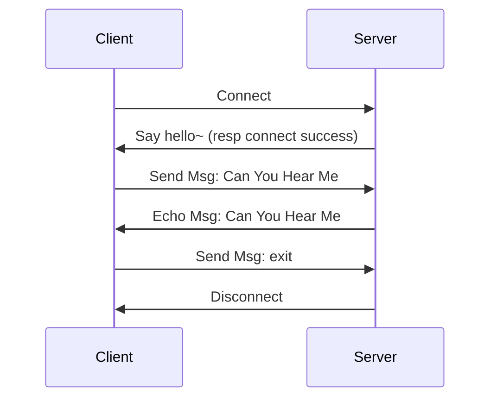
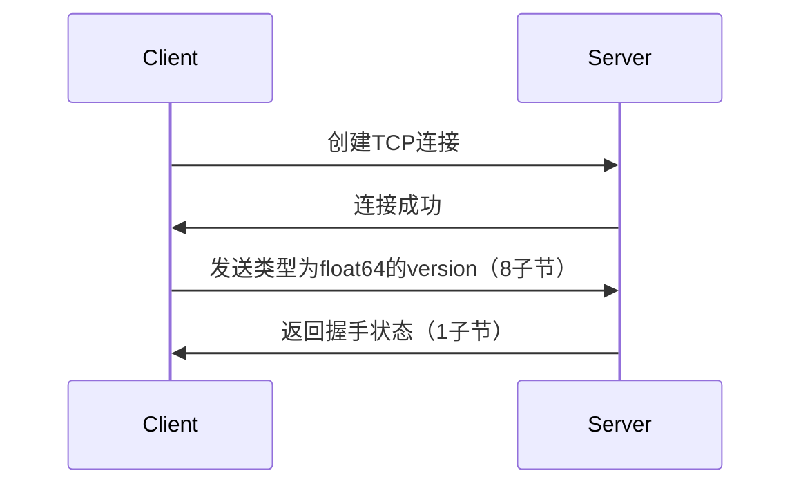

# 网络编程篇：TCP应用开发与握手设计
自从开始搭建了博客网站之后每天都在想写点什么，想了很久最终决定开启一个连续教学篇章「网络编程」

该篇章会从搭建简单的`C/S`架构应用开始，最终带着大家完成一个有意思的网络小应用（最终写啥还没想好，目前想到的有：简易RPC框架、VPN服务器、RTMP流媒体服务器），涉及编码的地方会用 Go(net库)、Java(Netty框架)来进行演示。

有什么想要实现的应用或是文章介绍时使用什么语言可以在下方给我评论哦～

::: tip
这篇文章会介绍最基础的网络编程应用`Echo服务器`来展示`TCP`协议服务端与客户端应用的基础开发流程。
:::

## TCP概念
* TCP(Transmission Control Protocol 传输控制协议)是一种面向连接(连接导向)的、可靠的、 基于IP的传输层协议。
* 首先来看看OSI的七层模型

* 我们需要知道TCP工作在网络OSI的七层模型中的第四层——传输层，IP在第三层——网络层，ARP 在第二层——数据链路层;同时，我们需要简单的知道，数据从 应用层发下来，会在每一层都会加上头部信息，进行 封装，然后再发送到数据接收端。这个基本的流程你需要知道，就是每个数据都会经过数据的封装和解封 装的过程。
* 在OSI七层模型中，每一层的作用和对应的协议如下：


> 再详细的介绍大家自行百度，这里就不过多介绍了

## 第一个TCP程序之Echo服务器
Echo(回声)服务分为客户端和服务端，简单来说就是 客户端发送字符串 给服务端，服务端 读取到客户端发送的数据后 再重新发送回客户端。



逻辑非常简单，下面我们就开始编码吧～

## Echo服务端编码
> 本次采用`Go`语言的`net`库进行代码示例
#### 1. 监听端口启动服务
```go
// 服务端监听地址
serverAddr := ":51000"
// 监听TCP协议端口
server, err := net.Listen("tcp", serverAddr)
```
#### 2. 循环接受客户端连接
> 当调用 `Accept()` 方法时会进行堵塞，直到下一个连接返回给监听器
```go
for {
    conn, err := server.Accept()
    // handle err
}	
```
#### 3. 处理客户端连接
> 由于服务端需要同时处理多个客户端连接，所以每接受到一个客户端连接，就打开一个协程来进行处理。
> 
> 通过 `defer` 声明当方法结束时关闭`conn`连接
> 
> 使用 `bufio` 库创建`Reader`、`Writer`，方便按行进行读取、写入字符数据
```go
go func() {
    // 方法结束时
    defer func() {
        err := recover()
        if err != nil {
            fmt.Println(err)
        }
        _ = conn.Close()
    }()
    // 创建 bufio 的 Reader、Writer
    reader := bufio.NewReader(conn)
    writer := bufio.NewWriter(conn)
}()
```

#### 4. 回应客户端连接成功：`say hello`
```go
_, _ = writer.WriteString("hello,  I'm Server.\n")
_ = writer.Flush()
```

#### 5. 读取客户端消息并回复
```go
for {
    data, _, err := reader.ReadLine()
    if err != nil {
        fmt.Println(err)
        return
    }
    line := string(data)
    fmt.Printf("receive from client: %s\n", line)
    if strings.ToLower(line) == "exit" {
        // 由于上面定义了 `defer` ，所以这里 return 退出循环，连接即可被关闭
        return
    } else {
        // 回应客户端消息
        _, _ = writer.WriteString(fmt.Sprintf("echo: %s\n", line))
        _ = writer.Flush()
    }
}
```

#### 6. 测试Echo服务端
服务端编码我们已经完成了，下面可以启动服务端，通过 `telnet` 工具作为客户端进行测试。

1. 启动`EchoServer`
```shell
go run server.go
```
2. `Telnet` 连接服务端
```shell
telnet 127.0.0.1 51000
```


## Echo客户端编码
> 客户端的开发过程与服务端类型，不再详细介绍。代码如下自行理解
```go
const serverAddr = "127.0.0.1:51000"
conn, err := net.Dial("tcp", serverAddr)
if err != nil {
    panic(err)
}
reader := bufio.NewReader(conn)
writer := bufio.NewWriter(conn)
go func() {
    for {
        data, _, err := reader.ReadLine()
        if err == io.EOF {
            fmt.Println("server disconnect...")
            os.Exit(0)
        }
        if err != nil {
            panic(err)
        }
        fmt.Println(string(data))
    }
}()
// 读取 stdin 标准输入流
stdinReader := bufio.NewReader(os.Stdin)
for {
    data, _, _ := stdinReader.ReadLine()
    _, _ = writer.WriteString(string(data) + "\n")
    _ = writer.Flush()
}
```
> 启动测试，效果与我们使用 `Telnet` 作为客户端一致


## 应用层协议握手(Handshake)设计
> 我们都知道 传输层`TCP`协议 为了「提供可靠的字节流服务，准确无误地将数据送达目的地」采用了三次握手、四次挥手，而应用层的协议一般也是有握手流程。

#### 为什么应用层协议也需要握手(自我理解)
> 通过上面的例子，我们通过 `Telnet` 工具就可以与服务端进行通信，并进入到`Echo服务端`核心逻辑处理中，而我并不想让非法客户端与服务端进行通信，就可以通过握手来对客户端进行简单的校验。   
> 通过握手让服务端接收到客户端连接后立刻对客户端进行有效认证，握手失败则断开连接，防止非法请求进入到后续逻辑中，如：报文解码

#### 握手逻辑设计
> 握手设计我们可以参考很多现有的应用层协议，如：`HTTP`、`RTMP` 等，有兴趣的可以自行百度了解。   
> 而本文采用一种非常简单的握手方式：客户端连接后发送`version`，服务端比较`version`是否与服务端匹配，若匹配则返回握手成功状态，否则返回握手失败并断开连接。





## 应用层握手编码
#### 1. 定义 `Handshake` 接口 与 握手状态
```go
// handshake/handshake.go

// Handler HandshakeHandler
type Handler interface {
	Handshake(conn io.ReadWriteCloser) error
}
// Status HandshakeStatus
type Status byte
const (
	UnknownError    Status = 0
	Success         Status = 1
	VersionNotMatch Status = 2
)
func NewError(status Status, message string) error {
	return errors.New(fmt.Sprintf("Handshake Handler Status is %d, Message: %v", int(status), message))
}
```
#### 2. 基于版本校验客户端握手实现
> 客户端发送大端模式(`binary.BigEndian`)的`float64`类型的版本号给服务端后，读取服务端握手状态返回(1byte)
```go
// handshake/version_impl.go
type VersionClientHandler struct {
	Version float64
}
func (t *VersionClientHandler) Handshake(conn io.ReadWriteCloser) error {
	// send version float64
	err := binary.Write(conn, binary.BigEndian, t.Version)
	if err != nil {
		return errors.New(fmt.Sprintf("Handshake Handler Status is %b, Message: %v", UnknownError, err.Error()))
	}

	// read handshake resp (1byte)
	buf := make([]byte, 1)
	n, err := conn.Read(buf)
	if err != nil {
		return errors.New(fmt.Sprintf("Handshake Handler Status is %b, Message: %v", UnknownError, err.Error()))
	}
	status := Status(buf[:n][0])
	if status != Success {
		return errors.New(fmt.Sprintf("Handshake Handler Status is %b", status))
	}
	return nil
}
func NewVersionClientHandler(version float64) *VersionClientHandler {
	return &VersionClientHandler{
		Version: version,
	}
}
```
#### 3. 基于版本校验服务端握手实现
> 读取客户端发送的版本数据，如果与服务端版本一致则返回`Sucess`状态码，否则返回错误状态并断开连接。
```go
type VersionServerHandler struct {
	Version float64
}

func (t *VersionServerHandler) Handshake(conn io.ReadWriteCloser) error {
	var version float64
	err := binary.Read(conn, binary.BigEndian, &version)
	if err != nil {
		return respHandshakeStatus(UnknownError, conn)
	}
	// var status Status
	var status Status
	if version != t.Version {
		status = VersionNotMatch
	} else {
		status = Success
	}
	return respHandshakeStatus(status, conn)
}
func respHandshakeStatus(status Status, conn io.ReadWriteCloser) error {
	data := [1]byte{byte(status)}
	_, err := conn.Write(data[:])
	if status == Success && err == nil {
		return nil
	}
	// close conn
	_ = conn.Close()
	if err != nil {
		return NewError(status, err.Error())
	}
	return NewError(status, "")
}
func NewVersionServerHandler(version float64) *VersionServerHandler {
	return &VersionServerHandler{Version: version}
}
```

#### 4. 服务端与客户端分别加入握手逻辑
```go
// ====== server ======
serverVersion := 1.0
// Accept Conn……
// do handshake
err := handshake.NewVersionServerHandler(serverVersion).Handshake(conn)
if err != nil {
    fmt.Println(err)
    return
}
fmt.Println("Handshake Done.")
// ====== client ======
// Dial Conn……
// do handshake
err = handshake.NewVersionClientHandler(clientVersion).Handshake(conn)
if err != nil {
    fmt.Println(err)
    return
}
fmt.Println("Handshake Done.")
```

## 应用层握手测试
> 分别使用`client.go`与`Telnet`作为客户端与服务端进行连接，查看运行结果


可以看到通过`client.go`发起的请求`Echo服务端`可以正常影响，而通过`Telnet`的请求则握手失败。

## 总结
通过本文简单介绍了`TCP`服务端与客户端的开发流程和应用层协议握手，虽然内容很简单但这是后续开发网络应用的基础。<br/>
后面还会继续更新网络编程篇章，最终带着大家实现一个网络应用(可在评论区提建议)。<br/>
文中涉及到的代码均会提供`Go(net)`和`Java(Netty)`两个版本，可以通过公众号「BUG工程师」发送消息领取哦～

---
下一章预告：「解决TCP粘包问题」与「请求/响应」模式事务设计